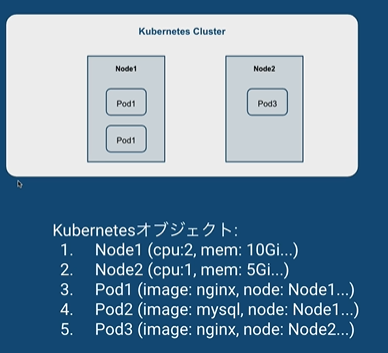

## Podの概要  

podとは  
Kubernetes上のデプロイの最小単位  

Dockerのデプロイ上の最小単位→コンテナ  
Kubernetes上のデプロイの最小単位→pod  

podは  
- 1つまたは複数のコンテナを持つ  
  →コンテナを複数持つことは基本的にはない  
    例えば、主コンテナのアプリケーションのログをサブコンテナが読み込む場合とか  
- 同一pod内では、ネットワークやストレージを共有リソースとして持つ  

## podを使って動かしてみる  

ファイルを使ったpod起動  
```
kubectl create -f pod.yml 
```
podが出来たことの確認  
```
kubectl get pod
```

イメージを使ったpod作成　　
```
kubectl run nginx --image=nginx
```

どちらもpodを作成できる  
作成自体は簡単であるが、設定できることが色々ある。  
設定の中を見てみるコマンド　　
```
kubectl get pod nginx -o jsonpath='{.spec}' | jq
```
「jp」はJSONを見やすくするコマンド  

設定をファイルに書き出すコマンド  
```
kubectl get pod nginx-yaml -o yaml > nginx-yaml.yaml
```


## kubernetesオブジェクト  

クラスタの状態を表現する  
- どんなコンテナアプリケーションが動いているか  
- 利用可能なリソースはどれだけか  
- アプリケーションの振る舞いに関するポリシー  

Podの作成＝Kubernetesオブジェクトを作成  
→？？？  

1つのクラスター内に存在するpodやnode＝kubernetesオブジェクト  
  


Kubernetesオブジェクトのフィールド  
このフィールドというのは2つあり
- spec: 理想状態(desired state)  
  - kubectlやプログラムにより変更する  
  - 例、kubectl apply -f pod.yaml  
- status: 現実状態(current state)  
  - Kubernetesにより更新される  

コントロールプレーンは、理想状態と現実状態が一致するように管理  

### Kubernetesオブジェクト作成に必須の情報（4つ）  
- apiVersion: どのバージョンのKubernetes APIかを指定する  
  例 v1  

- kind: どの種類のオブジェクトか  
  例 Pod,Deployment  

- metadata: オブジェクトを一意に識別する情報  
  例 name.,UID,namespace  

- spec: 理想状態  
  内容はオブジェクトごとに異なる  

pod作成時の例  
```yaml
apiVersion: v1
kind: Pod
metadata:
  name: nginx-yaml
spec:
  containers:
    - image: nginx
      name: nginx
```

### Namespace  

リソースの一つ  
同一の物理クラスター上で複数の仮想クラスターの動作をサポートする。  
この「仮想クラスター」のことをNamespaceという。  

仮想クラスタとは、実際には同じマシン上で動いているかもしれないが、仮想的に環境が分けられている状態  


### 2種類のリソース：Namespace vs Cluster  

- Namespace-scoped リソース：  
  Namespaceに属しているリソースで、Namespace削除時には削除される  
  Namespace内で名前はUniqueである必要がある   
- Cluster-scoped リソース：
  Namespaceに属していないリソース  
  クラスタ全体で使われるもの  
  クラスタ内で名前はUniqueである必要がある  

### Namespaceのコントロール  

- Namespaceの作成・削除  
  kubectl create/delete namespace <Namespace名>  
- ある特定のNamespaceのオブジェクトを操作する  
  kubectl [command] [TYPE] --namespace <Namespace名> or -n <Namespace名>  


## ワークロードリソース  

複数のPodを作成・管理するためのリソース  
例  
- ReplicaSet: 指定したレプリカ数のPodを常に保証する  
など  

Podテンプレート：ワークロードリソースはPodを作成するため、Podの定義書が必要。その定義書のこと  

### ReplicaSet  

指定したレプリカ数のPodを常に保証する。  

フィールド  
- replicas: 稼働させたいPodの数  
- pod templates: Podを作成するときのテンプレート  
- selector: 対象となるPodを特定するため  
   Podテンプレート内のラベルは同じである必要がある  

## Deployment  

ローリングアップデートやロールバックなどのアップデート機能を提供  
主な機能  
- ReplicaSetのロールアウト（更新）  
- 不安定な場合の前のバージョンへロールバック  
- スケールアップ、ダウンする（ReplicaSetのreplica数変更）  
使用頻度：高  
  ほとんどのアプリケーションはDeploymentで管理  
フィールド  
  ReplicaSetとほとんど同じ  

### Deployment特有のフィールド  

- strategy: 更新戦略  
  - type:"Recreate"か"RollingUpdate"を指定  
     デフォルトは"Rollingupdate"  
  - RollingUpdateの場合には  
     maxUnavailable：更新処理中に利用不可になるPodの最大数  
     maxSurge：更新処理にいくつエクストラで追加できるPodの最大数  

- revisionHistory: 過去のバージョンとしてReplaceSetを残しておく数
    デフォルとは10  
- paused：一時停止されているかどうか　
- progressDeadlineSeconds: 更新プログレスの最大秒数  
    デフォルトは600uooooooooo  

### Deploymentの流れ  

1. Deploymentを作成：kubectl apply -f deployment.yaml  
2. Deploymentのオブジェクトが作成される  
3. DeploymentコントローラがDeploymentオブジェクトを常にチェックして  
   RepliceSetオブジェクが生成される  
   a. ReplicaSetが作られるReplicaSetコントローラによりPodも作成される  
4. DeploymentのImageを更新する  
5. 新しいReplicaSetオブジェクトを作成し、古いReplicaSetのreplicasを減らし  
   新しいReplicaSetを作成しreplicasを増やし、最終的にそれぞれ0と2にする  


## ConfigMap（設定用リソース）  

機密性のないデータをキーと値のペアで保存し、Podから参照可能  
利点  
  コンテナイメージと環境固有の設定を切り離す→アプリケーションがポータルになる  
例  
  アプリケーションの接続先DBのHOST、User、Port  
  confファイル  
使用方法  
  コンテナの環境変数の設定  
  読み取り専用のボリュームを作成し、コンテナから読み込む  


## Secret(設定用リソース)  

機密情報（パスワード、トークンなど）を保存・管理し、Podから参照可能  
種類  
  - Opaque  
  - kubernetes.io/dockercfg  
  - kubernetes.io/basic-auth など  
例  
  - アプリケーションへの接続パスワード  
  - Dockerレジストリへのアクセス権限  
使用方法  
  - ボリューム内のファイルとして、Pod内のコンテナにマウントする  
  - コンテナの環境変数の設定  
  - kubeletがDockerイメージをpullする際に使用  

## Service  

Podの集合を抽象化して公開  
- Podの集合に対するDNS名  
- Podの集合に対する負荷分散  

各PodはIPアドレスを持っているが、Podの作成・削除のたびに、アプリケーションのIPアドレスの集合が変化するのは大変。  
→ServiceがDNS名を提供し、後ろにあるIPアドレスの管理をしてくれる  
(常に同じ名前を使ってアプリケーションを参照できる)  

- Serviceは対象となるPodを認識する必要がある。→セレクター  
- Podのマッピングも可能  
  - Service側のPortとPodのPortが異なってもOK  
  


