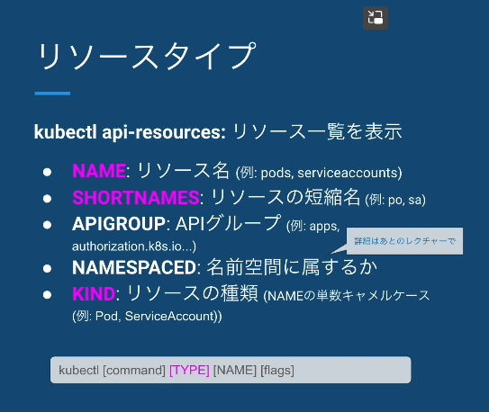
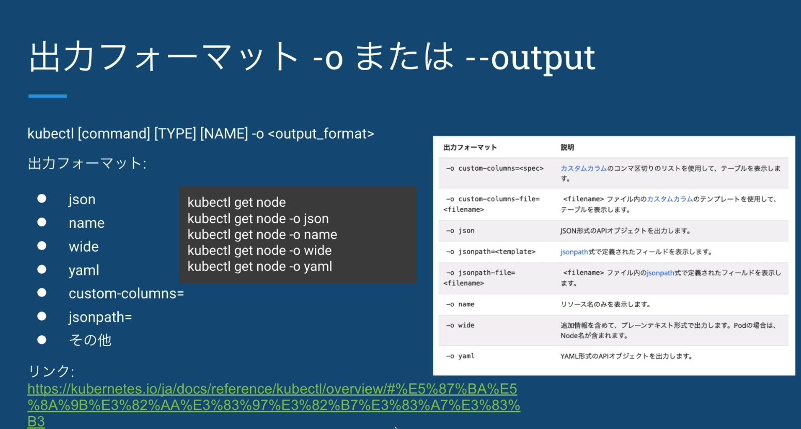
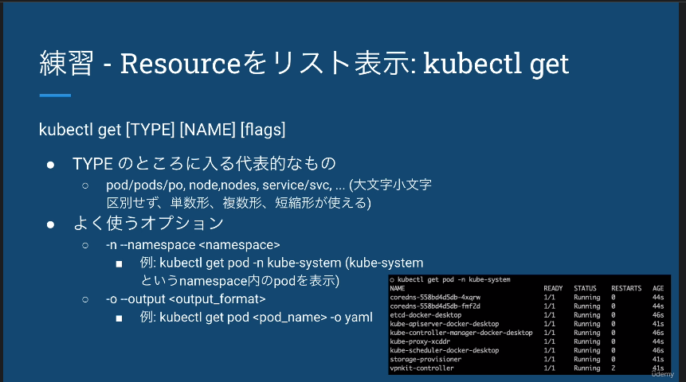

# kubectlとは  

yamlやコマンドをAPIリクエストに変えてapi-serverにHTTPリクエストを送る  

## kubectlの構文  

構文  

[リファレンス](https://kubernetes.io/ja/docs/reference/kubectl/overview/)  

kubectl [command] [TYPE] [NAME] [flags]  

- command:実行したい操作（get,create,patch,delete）  
- TYPE:リソースのタイプ（pod,node,service,deployment）  
- NAME:リソース名  
- flags:オプションのflag(--kubeconfigなど)

## リソースタイプ  

構文のTYPEにはどのようなモノが入るか  

kubectl api-resources  
カラムの紹介  
  

## 出力フォーマット  

[リファレンス](https://kubernetes.io/ja/docs/reference/kubectl/overview/#%E5%87%BA%E5%8A%9B%E3%82%AA%E3%83%97%E3%82%B7%E3%83%A7%E3%83%B3)  

kuebctl [command] [TYPE] [NAME] -o <output_format>  

  

## Resourceをリスト表示  

kubectl get [TYPE] [NAME] [flags]  

  

## リソースの詳細を表示  

kubectl describe [TYPE] [NAMEPREFIX] [flags]  

## リソースの作成・削除  

kubectl create/delete -f FILENAME  

## 出てくる単語  
- namespace  
  →？  
- リソース  
  →？  